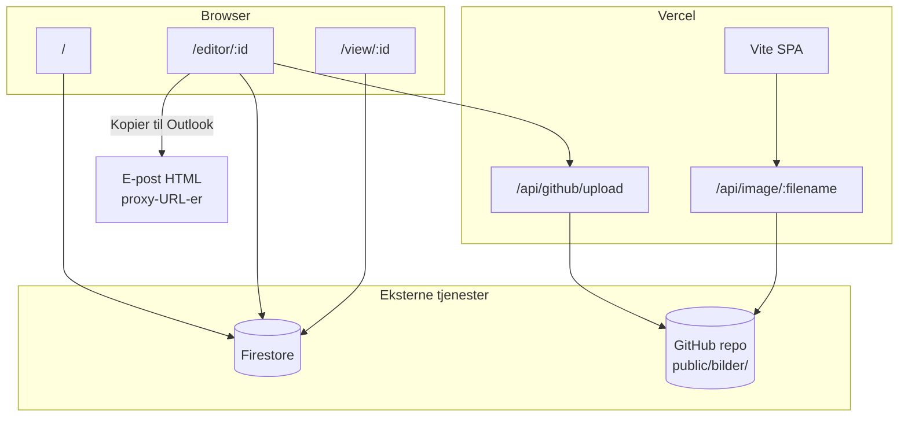

# Nyhetsbrevverktøy — handover-dokumentasjon

Internt nyhetsbrevverktøy for **Oslo kommune / Helsefellesskap Oslo (OUS)** — prosjektet «Sammen om rask og riktig psykisk helsehjelp til barn og unge».

**Prod:** https://nyhetsbrev-phi.vercel.app  
**Repo:** https://github.com/tomstianlarsen-dotcom/Nyhetsbrev  
**Kunde-kontakt:** Kjersti Sirevåg (prosjektleder)

---

## 1. Hva produktet gjør

1. **Redigere** nyhetsbrev i nettleser (seksjoner, bilder, footer, byline)
2. **Lagre** utkast i Firestore
3. **Forhåndsvise** responsivt (desktop/mobil) og publisere **online-visning** (`/view/:id`)
4. **Kopiere HTML til Outlook** for utsendelse via e-postklient
5. **Eksportere PDF**
6. **Bildebibliotek** med opplasting til GitHub

Kunden sender nyhetsbrev **selv** — de kopierer HTML fra editoren og limer inn i Outlook. Det finnes ingen innebygd «send e-post»-funksjon.

---

## 2. Tech stack

| Lag | Teknologi |
|-----|-----------|
| Frontend | **React 19**, **TypeScript**, **Vite 6** |
| Styling | **Tailwind CSS v4** |
| Routing | **React Router v7** |
| Database / auth | **Firebase** (Firestore + anonym Auth) |
| Hosting | **Vercel** (statisk SPA + serverless `/api/*`) |
| Bildehosting | **GitHub** (`public/bilder/` i repo) |
| Bilde-levering | **Vercel proxy** (`/api/image/:filename`) |
| PDF | `@react-pdf/renderer` (+ html2pdf fallback) |

**Ikke i bruk:** Next.js, Supabase, Lovable, Flutter, Firebase Storage (avvist pga Spark-plan).

---

## 3. Arkitektur



### Bilde-flyt (viktig for OUS)

1. Bruker laster opp bilde → `POST /api/github/upload` → fil committes til GitHub
2. Metadata lagres i Firestore `images`-collection (URL peker på `raw.githubusercontent.com/...`)
3. I preview/e-post: `toProxyImageUrl()` omskriver til `https://nyhetsbrev-phi.vercel.app/api/image/{filename}`
4. Proxy henter fra GitHub server-side og streamer til mottaker

**Hvorfor:** OUS/Sykehuspartner blokkerer `raw.githubusercontent.com` (siden 2019). Mottakere skal kun se `nyhetsbrev-phi.vercel.app`.

---

## 4. Ruter

| Path | Komponent | Beskrivelse |
|------|-----------|-------------|
| `/` | `Dashboard.tsx` | Liste over nyhetsbrev, opprett nytt, bildebibliotek |
| `/editor/:id` | `Editor.tsx` | Redigering (`id=new` for nytt) |
| `/editor/:id` + preview | `Preview.tsx` | WYSIWYG-forhåndsvisning |
| `/view/:id?view=browser` | `PublicView.tsx` | Offentlig online-visning (skjuler «Se online»-lenke) |

---

## 5. Firestore

**Prosjekt:** `gen-lang-client-0131877870`  
**Config:** `firebase-applet-config.json` (ikke kundens `ous-nyhetsbrev-db`)

**Auth:** Anonym innlogging (`ensureAuth()`). Må være aktivert i Firebase Console.

### Collections

#### `newsletters/{id}`

```ts
{
  data: NewsletterData,  // se src/types.ts
  updatedAt: Timestamp,
  createdAt?: Timestamp,
  title?: string
}
```

#### `images/{id}`

```ts
{
  url: string,           // GitHub raw URL
  githubPath?: string,   // f.eks. public/bilder/1777314120650-Header.png
  name: string,
  size: number,
  type: string,
  uploadedAt: Timestamp,
  userId: string
}
```

Nyhetsbrev lagrer ofte `imageId` i tillegg til URL, og resolver bilder ved lasting hvis URL mangler.

---

## 6. Nøkkelfiler

| Fil | Ansvar |
|-----|--------|
| `src/Editor.tsx` | Lagring, PDF, **Kopier til Outlook** (HTML-transformasjon) |
| `src/components/Preview.tsx` | HTML-struktur for nyhetsbrev (tabell-basert e-post-layout) |
| `src/components/PublicView.tsx` | Offentlig visning, bilde-oppløsning |
| `src/components/ImageManager.tsx` | Opplasting/sletting av bilder |
| `src/constants.ts` | Farger, `TYPOGRAPHY`, `applyEmailTypography()`, `NEWSLETTER_MOBILE_LAYOUT_CSS` |
| `src/lib/imageUrls.ts` | Proxy-URL-logikk (`toProxyImageUrl`, `rewriteImageUrlsInElement`) |
| `src/lib/emailLayout.ts` | `prepareImageTextTablesForEmail()` — kolonnebredder ved e-post-kopiering |
| `api/github/upload.ts` | Server-side GitHub-opplasting (Vercel serverless) |
| `api/image-file.ts` | Bilde-proxy (GET, henter fra GitHub) |
| `api/image.ts` | Legacy proxy med `?src=` query |
| `vercel.json` | SPA rewrite + `/api/image/:filename` → `image-file` |
| `src/index.css` | Mobil-layout for online preview (synk med `NEWSLETTER_MOBILE_LAYOUT_CSS`) |

---

## 7. E-post: «Kopier til Outlook»

Pipeline i `Editor.tsx` → `handleCopyOutlook()`:

1. Auto-lagre til Firestore
2. Klone `previewRef` DOM
3. Fjerne `contenteditable`, onclick, referrerpolicy
4. **Blokkere base64**-bilder (må bruke HTTPS/proxy-URL)
5. Hero-bilde: `width: 100%; max-width: 600px` (fluid, unngår mobil zoom-out)
6. Normalisere tabeller (600px → fluid `width:100%; max-width:600px`)
7. `prepareImageTextTablesForEmail()` — side-om-side bilde+tekst (200px + 324px), fjern spacer-kolonner
8. `applyEmailTypography()` — desktop → mobil størrelser inline (Gmail ignorerer `@media`)
9. `rewriteImageUrlsInElement()` — alle bilder via proxy
10. Wrap i MSO-conditional + fluid outer table
11. Kopier til utklippstavle

### E-post-begrensninger

- **Outlook desktop** ignorerer `@media` — bilde+tekst forblir side-om-side i e-post (bevisst valg)
- **Mobil e-post-stacking** skjer kun der klienten støtter `@media` (Apple Mail m.fl.)
- **Online-visning** (`/view/...`) bruker CSS-stacking på mobil via `.nl-stack` klasser
- Endringer i e-post krever **ny kopiering** — utsendte e-poster oppdateres ikke

### Typografi (e-post vs preview)

| | Desktop preview | Mobil preview | E-post (ved kopiering) |
|--|-----------------|---------------|------------------------|
| Body | 16px | 18px | 18px inline |
| Heading | 22px / 600 | 24px / 600 | 24px inline |
| Heading (første seksjon) | 28px | 30px | 30px inline |

Editor bruker `typographyMode="desktop"` — alltid desktop i editoren.

---

## 8. Seksjonstyper

Definert i `src/types.ts`:

| Type | Beskrivelse |
|------|-------------|
| `text` | Overskrift + brødtekst |
| `image-text` | Bilde + tekst side om side (klasse `nl-stack`) |
| `full-image` | Fullbredde bilde |
| `list` | Liste med profilbilder (80px) |
| `grid` | 2-kolonne grid med bilder |

---

## 9. Miljøvariabler

Se `.env.example`. Sett i **Vercel** (Production + Preview) og lokalt i `.env.local`.

| Variabel | Formål |
|----------|--------|
| `VITE_APP_URL` | `https://nyhetsbrev-phi.vercel.app` — brukes i proxy-lenker i e-post |
| `VITE_GITHUB_TOKEN` | GitHub PAT (**classic**, scope `repo`) for upload API |
| `VITE_GITHUB_OWNER` | `tomstianlarsen-dotcom` |
| `VITE_GITHUB_REPO` | `Nyhetsbrev` |
| `VITE_GITHUB_IMAGES_PATH` | `public/bilder` (valgfritt) |

**GitHub-token:** Må opprettes på kontoen **tomstianlarsen-dotcom** (ikke tomstianlarsen-cloud). Fine-grained token krevde `Contents: Read and write` på repoet; classic med `repo` fungerte påliteligst.

**Sikkerhetsnote:** `VITE_GITHUB_TOKEN` er også lest i `ImageManager.tsx` for **klient-side sletting** av bilder — tokenet er dermed eksponert i nettleseren. Vurder å flytte sletting til server-side API.

---

## 10. Deploy og git

### Brancher

| Branch | Status |
|--------|--------|
| `main` | Produksjons-baseline (kan ligge bak feature branch) |
| `cursor/gmail-responsive-wrapper` | Aktiv utviklingsbranch med e-post/typografi/proxy-fikser |

**PR #1** (draft): Gmail-responsivitet, PDF, proxy — sjekk merge-status mot `main`.

Vercel kan deploye fra feature branch direkte til Production (verifisert juli 2026).

### Kommandoer

```bash
npm install
npm run dev          # lokal dev (port 3000) — upload API krever vercel dev eller prod
npm run build
npm run lint         # tsc --noEmit
```

For lokal test av upload/proxy:

```bash
npx vercel dev
```

---

## 11. Kundekontekst (OUS / Sykehuspartner)

### Testresultater (Kjersti, juni 2026)

| Scenario | Resultat |
|----------|----------|
| OUS desktop (e-post + nett) uten OUS-utsendelse | Bilder lastes **ikke** (sannsynlig blokkering av `nyhetsbrev-phi.vercel.app`) |
| OUS jobbmobil | Bilder OK etter proxy; banner/padding/typografi justert |
| **Utsendelse fra OUS e-postadresse/PC** | Alt fungerer på OUS nett og Oslo kommune ✅ |
| Anbefalt drift | Send fra OUS-adresse |

### Plan B

**Whitelisting** av `https://nyhetsbrev-phi.vercel.app` hos Sykehuspartner — samme type sak som GitHub-blokkering (2019). Relevant hvis:
- de sender fra andre adresser enn OUS
- lesere på OUS desktop skal åpne online-visning uten blokkering

### Firebase Storage

Migrering GitHub → Firebase Storage ble **avvist** — Storage krever Blaze-plan. Alle migreringsforsøk feilet med `storage/unknown` (404). Løsningen er **GitHub + Vercel proxy**.

---

## 12. Kjente issues / teknisk gjeld

1. **`VITE_GITHUB_TOKEN` i klient** — sletting av bilder fra nettleser eksponerer token (revokert én gang av GitHub pga lekkasje)
2. **PR #1 ikke merget til `main`** — repo og prod-deploy kan være ute av sync
3. **Mobil e-post-stacking** — ikke garantert i Outlook; side-om-side er default i e-post
4. **Firebase-prosjekt** i kode (`gen-lang-client-0131877870`) er ikke kundens eget Firebase-prosjekt
5. **Diverse scripts** i rot (`cleanup_images.ts`, `migrate_*.ts`, etc.) — engangsverktøy, ikke del av appen
6. **`api/image.ts`** — legacy `?src=` handler; prefer `api/image-file.ts` + clean URLs

---

## 13. Typiske oppgaver for videreutvikling

### Endre typografi
→ `src/constants.ts` (`TYPOGRAPHY`, `applyEmailTypography`, `EMAIL_TYPOGRAPHY_SCALE`)

### Endre e-post-layout
→ `src/components/Preview.tsx` (HTML) + `src/Editor.tsx` (copy pipeline) + `src/lib/emailLayout.ts`

### Endre mobil online-visning
→ `src/index.css` + `NEWSLETTER_MOBILE_LAYOUT_CSS` i `constants.ts` (hold synkronisert)

### Ny bildehost
→ `api/github/upload.ts`, `api/image-file.ts`, `src/lib/imageUrls.ts`

### Ny seksjonstype
→ `src/types.ts`, `Preview.tsx`, `Editor.tsx` (sidebar), ev. PDF i `NewsletterPdf.tsx`

---

## 14. Verifikasjon etter deploy

1. `https://nyhetsbrev-phi.vercel.app/api/image/1777314120650-Header.png` — skal returnere PNG
2. Bildeopplasting i bildebiblioteket
3. Kopier til Outlook → lim i Gmail/Outlook → sjekk bilder, typografi, ingen klipping i bilde+tekst
4. `/view/{id}?view=browser` på mobil — header full bredde, stacking, padding

---

## 15. Kontakt og tilgang

- **GitHub repo:** `tomstianlarsen-dotcom/Nyhetsbrev`
- **Vercel:** prosjekt `nyhetsbrev-phi`
- **Firebase Console:** prosjekt `gen-lang-client-0131877870`

Ved token-problemer: opprett ny **classic PAT** med `repo` på `tomstianlarsen-dotcom`, oppdater `VITE_GITHUB_TOKEN` i Vercel, redeploy.

---

*Sist oppdatert: juli 2026 — etter typografi-, padding-, e-post-layout- og GitHub-token-fikser.*
